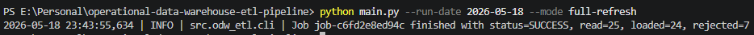
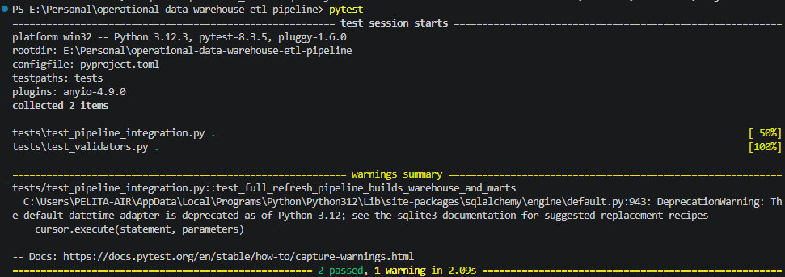
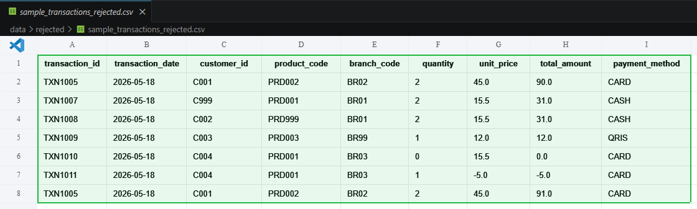
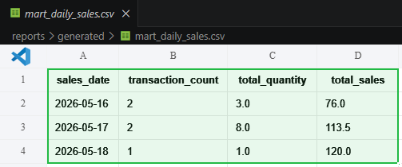

# Operational Data Warehouse ETL Pipeline

English and Indonesian README for a portfolio ETL project. This repository is meant to feel like a real sample project: small enough to run locally, but structured like a proper ETL and warehouse workflow.

---

## English

### Overview

This project demonstrates a local ETL pipeline that ingests operational data from multiple source types, validates the data, loads staging tables, builds a dimensional warehouse model, and publishes reporting marts.

Source coverage:

- CSV transactions
- Excel customer master
- JSON product master
- mock API branch master

### Business Problem

Teams often receive operational data from several systems with inconsistent formats and uneven data quality. Without a controlled ETL process, reporting becomes unreliable, duplicate records slip through, and reconciliation takes too much manual work.

This project focuses on the practical parts of that problem:

- source ingestion
- validation and rejection handling
- audit logging
- warehouse transformation
- reporting mart generation

### Tech Stack

- Python 3.11+
- Pandas
- SQLAlchemy
- SQLite
- YAML
- pytest
- logging
- argparse

### Architecture

```text
CSV / Excel / JSON / Mock API
            |
            v
        Extract Layer
            |
            v
   Validation + Rejections
            |
            v
       Staging Tables
            |
            v
   Dimensional Warehouse
            |
            v
     Reporting Data Marts
```

### ETL Flow

1. Read source data from files and mock API.
2. Log file and source metadata into `raw_file_logs`.
3. Normalize master data before loading staging.
4. Validate transactions against business rules.
5. Store invalid rows in `validation_errors`, `rejected_records`, and rejected CSV output.
6. Load valid rows into `stg_transactions`.
7. Build dimensions and `fact_transactions`.
8. Generate reporting marts and export CSV files.
9. Log run status and metrics into `etl_job_logs`.

### Database Layers and Tables

Raw and audit:

- `raw_file_logs`
- `etl_job_logs`
- `validation_errors`
- `rejected_records`

Staging:

- `stg_transactions`
- `stg_customers`
- `stg_products`
- `stg_branches`

Warehouse:

- `dim_date`
- `dim_customer`
- `dim_product`
- `dim_branch`
- `fact_transactions`

Data marts:

- `mart_daily_sales`
- `mart_branch_performance`
- `mart_product_performance`
- `mart_reconciliation_summary`

### Data Warehouse Model

The warehouse uses a simple star-style design:

- `fact_transactions` stores transaction-level measures
- `dim_date` supports time analysis
- `dim_customer` supports customer analysis
- `dim_product` supports product analysis
- `dim_branch` supports branch analysis

### Validation Rules

- required fields must not be empty
- transaction date must be valid
- transaction ID must be unique
- customer ID must exist in customer master
- product code must exist in product master
- branch code must exist in branch master
- quantity must be greater than zero
- unit price must be greater than zero
- total amount must equal `quantity * unit_price`

### Project Structure

```text
.
├── config/
├── data/
│   ├── raw/
│   └── rejected/
├── database/
├── logs/
├── reports/
│   └── generated/
├── src/
│   └── odw_etl/
├── tests/
├── main.py
├── pyproject.toml
└── README.md
```

### How to Run Locally

```powershell
python -m venv .venv
.venv\Scripts\activate
pip install -e .[dev]
python main.py --run-date 2026-05-18 --mode full-refresh
```

### CLI Examples

```powershell
python main.py --run-date 2026-05-18
python main.py --mode full-refresh
python main.py --mode incremental
python main.py --source transactions
```

### Sample Reports

Tracked sample outputs are included in:

- `reports/generated/mart_daily_sales.csv`
- `reports/generated/mart_branch_performance.csv`
- `reports/generated/mart_product_performance.csv`
- `reports/generated/mart_reconciliation_summary.csv`
- `data/rejected/sample_transactions_rejected.csv`

### Screenshots

**ETL pipeline execution**

Successful full refresh run showing job status and record counts.



**Automated test result**

Current pytest result for validation and integration coverage.



**Rejected records sample**

Example of rows rejected by the validation rules.



**Daily sales mart sample**

Example of reporting output generated by the pipeline.



### Portfolio Notes

- This is a local-first ETL sample project for GitHub portfolio use.
- SQLite is used to keep setup simple and reproducible.
- The focus is ETL structure, validation logic, and warehouse modeling rather than infrastructure scale.

### Data Disclaimer

All data in this repository is mock or anonymized. No real credentials, company data, or production endpoints are included.

---

## Indonesia

### Gambaran Proyek

Proyek ini menunjukkan pipeline ETL lokal yang mengambil data operasional dari beberapa jenis sumber, memvalidasi kualitas data, memuat data ke tabel staging, membangun model data warehouse dimensional, lalu menghasilkan data mart untuk reporting.

Cakupan sumber data:

- transaksi CSV
- master customer dari Excel
- master product dari JSON
- master branch dari mock API

### Masalah Bisnis

Dalam banyak tim, data operasional datang dari beberapa sistem dengan format yang tidak seragam dan kualitas data yang tidak selalu konsisten. Tanpa proses ETL yang rapi, hasil reporting jadi tidak stabil, duplikasi data mudah lolos, dan proses rekonsiliasi jadi manual.

Proyek ini fokus pada bagian yang paling relevan secara praktis:

- ingestion data sumber
- validasi dan penanganan data reject
- audit logging
- transformasi data warehouse
- pembuatan reporting mart

### Tech Stack

- Python 3.11+
- Pandas
- SQLAlchemy
- SQLite
- YAML
- pytest
- logging
- argparse

### Arsitektur

```text
CSV / Excel / JSON / Mock API
            |
            v
        Extract Layer
            |
            v
   Validation + Rejections
            |
            v
       Staging Tables
            |
            v
   Dimensional Warehouse
            |
            v
     Reporting Data Marts
```

### Alur ETL

1. Membaca data sumber dari file dan mock API.
2. Mencatat metadata file dan sumber ke `raw_file_logs`.
3. Menormalkan master data sebelum dimuat ke staging.
4. Memvalidasi transaksi berdasarkan aturan bisnis.
5. Menyimpan baris tidak valid ke `validation_errors`, `rejected_records`, dan file CSV rejected.
6. Memuat data valid ke `stg_transactions`.
7. Membangun dimension table dan `fact_transactions`.
8. Menghasilkan data mart dan mengekspor file CSV.
9. Menyimpan status run dan metrik ke `etl_job_logs`.

### Layer Database dan Tabel

Raw dan audit:

- `raw_file_logs`
- `etl_job_logs`
- `validation_errors`
- `rejected_records`

Staging:

- `stg_transactions`
- `stg_customers`
- `stg_products`
- `stg_branches`

Warehouse:

- `dim_date`
- `dim_customer`
- `dim_product`
- `dim_branch`
- `fact_transactions`

Data mart:

- `mart_daily_sales`
- `mart_branch_performance`
- `mart_product_performance`
- `mart_reconciliation_summary`

### Model Data Warehouse

Warehouse ini memakai desain bergaya star schema yang sederhana:

- `fact_transactions` menyimpan metrik level transaksi
- `dim_date` untuk analisis waktu
- `dim_customer` untuk analisis customer
- `dim_product` untuk analisis product
- `dim_branch` untuk analisis branch

### Aturan Validasi

- field wajib tidak boleh kosong
- tanggal transaksi harus valid
- transaction ID harus unik
- customer ID harus ada di master customer
- product code harus ada di master product
- branch code harus ada di master branch
- quantity harus lebih besar dari nol
- unit price harus lebih besar dari nol
- total amount harus sama dengan `quantity * unit_price`

### Struktur Proyek

```text
.
├── config/
├── data/
│   ├── raw/
│   └── rejected/
├── database/
├── logs/
├── reports/
│   └── generated/
├── src/
│   └── odw_etl/
├── tests/
├── main.py
├── pyproject.toml
└── README.md
```

### Cara Menjalankan Lokal

```powershell
python -m venv .venv
.venv\Scripts\activate
pip install -e .[dev]
python main.py --run-date 2026-05-18 --mode full-refresh
```

### Contoh CLI

```powershell
python main.py --run-date 2026-05-18
python main.py --mode full-refresh
python main.py --mode incremental
python main.py --source transactions
```

### Contoh Output

Sample output yang ikut repo ada di:

- `reports/generated/mart_daily_sales.csv`
- `reports/generated/mart_branch_performance.csv`
- `reports/generated/mart_product_performance.csv`
- `reports/generated/mart_reconciliation_summary.csv`
- `data/rejected/sample_transactions_rejected.csv`

### Screenshot

**Eksekusi pipeline ETL**

Hasil full refresh yang sukses, menampilkan status job dan jumlah record yang diproses.


**Hasil automated test**

Hasil `pytest` saat ini untuk coverage validasi dan integration test.


**Contoh rejected records**

Contoh baris data yang ditolak oleh aturan validasi.


**Contoh data mart harian**

Contoh output reporting yang dihasilkan pipeline.


### Catatan Portfolio

- Repo ini memang disusun sebagai sample ETL project untuk portfolio GitHub.
- SQLite dipakai supaya setup lokal tetap ringan dan mudah direplikasi.
- Fokus utamanya ada pada struktur ETL, logika validasi, dan modeling warehouse, bukan pada skala infrastruktur.

### Disclaimer Data

Semua data di repository ini bersifat mock atau sudah dianonimkan. Tidak ada credential asli, data perusahaan, atau endpoint produksi.
